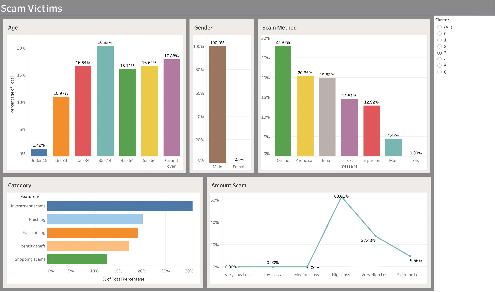

# **Fraud & Scam Detection (Python + Tableau)**
---

## 📌 **Problem Statement**  
Traditional fraud detection systems are often reactive, flagging fraud after transactions occur
This project explores how **machine learning** can be used to proactively detect suspicious applications during the onboarding process — reducing losses and improving early prevention.

---

## **Objectives**  
1. **Cluster** applicants to uncover patterns of vulnerability or risk (unsupervised learning)
2. **Predict** suspicious applications using supervised learning models

---

## **Datasets**

### **ScamWatch (Australia)**  
Consumer-reported scam data (2022–2025) from the Australian Competition and Consumer Commission
Used for victim profiling via clustering

**Limitations:** Self-reported data, geographically constrained, incomplete reports

---

### **Kaggle Bank Account Fraud Dataset**  
1M+ synthetic financial records with 30+ features representing demographics and banking activity
Used for **fraud classification** modelling

**Limitations:** Synthetic data, simplified features, not fully representative of real-world complexity

---

## **Data Preparation**

### **ScamWatch Dataset**
- **Removed** nulls and outliers in `Amount_Lost` (> \$1M)
- **Dropped** irrelevant columns (`StartOfMonth`, `Address_State`, `Category_Level_2`)
- **Cleaned** unspecified categories
- **Engineered** new feature: Amount Loss Groups (Very Low → Extreme Loss)

### **Kaggle Dataset**
- **Retained** missing values to simulate realistic incomplete onboarding data
- **Removed** constant-value features (`device_fraud_count`)
- **Preserved** meaningful outliers as potential fraud indicators

---

## **Methodology**

### **Unsupervised Learning — Clustering (Victim Profiling)**
- **Encoded** categorical data using one-hot encoding and frequency weighting
- **Evaluated** multiple clustering algorithms: **K-Means**, **HDBSCAN**, and **Hierarchical Clustering**
- **Applied** **UMAP** for dimensionality reduction before final clustering
- **Best Result:** K-Means (K=7, silhouette score = **0.542**)

**Key Victim Insights:**  
- Most victims aged **35–44**
- **Males** more frequently affected
- **Online platforms** were the dominant scam channel
- **Investment scams** most prevalent, typically with losses **< \$1,000**

---

### **Supervised Learning — Classification (Fraud Detection)**
- **Split** dataset by month (0–5 train, 6–7 test)
- **Tested** imbalance-handling strategies: **undersampling**, **SMOTE**, and **SPW**

**Models Evaluated:**

| **Model** | **Imbalance Strategy** | **Precision** | **Recall** | **F1-Score** |
|------------|------------------------|----------------|-------------|---------------|
| **Logistic Regression** | Undersampling | 0.20 | 0.31 | **0.24** |
| **XGBoost** | SPW | 0.07 | 0.77 | 0.12 |
| **XGBoost** | Undersampling | 0.15 | 0.37 | 0.21 |
| **Random Forest** | SMOTE | 0.10 | 0.39 | 0.16 |

**Final Model:** **Logistic Regression** — best balance of interpretability and F1-score

---

## **Deployment Recommendation**

### **Stage 1:**  
Deploy **Logistic Regression** as the **real-time fraud classifier** during new account creation
- Lightweight, fast, and interpretable
- Flags high-risk applications for manual verification

### **Stage 2:**  
Integrate **ScamWatch cluster insights** as a **behavioural risk multiplier**
- Matches new applicants to known victim profiles
- Enhances model sensitivity to high-risk behaviour patterns

---

## **Results Summary**

| **Metric** | **Best Model** | **Result** |
|-------------|----------------|-------------|
| **Precision** | Logistic Regression | 0.20 |
| **Recall** | Logistic Regression | 0.31 |
| **F1 Score** | Logistic Regression | **0.24** |

**Interpretation:**  
While recall remains modest due to class imbalance, the model achieves a practical trade-off — suitable for live fraud-screening workflows where **false negatives** are costlier than false positives

---

## **Key Takeaways**
- **Hybrid ML Approach:** Combining clustering and classification enhances early fraud detection
- **Scalability:** Modular design supports retraining with updated data
- **Business Value:** Enables financial institutions to shift from *reactive* to *proactive* fraud management

---

## **Future Enhancements**
- **Integrate** real-world bank data for model validation.  
- **Improve** recall with advanced techniques (e.g., **Focal Loss**, **Ensemble Models**).  
- **Develop** an end-to-end **dashboard or API** for real-time detection and monitoring.

---

## **Clustering Preview**
**Clustering Preview**

